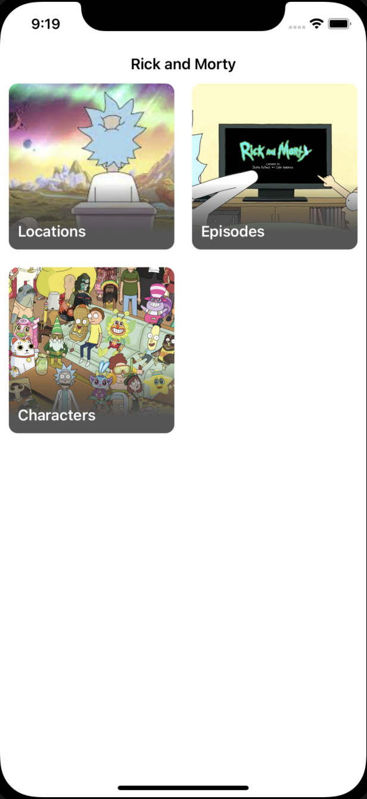

# Rick And Morty
 - Architecture: Clean Architecture + MVVM + Coordinator
 - Libraries: Combine
 - UI: XIBs and programmatic view. No storyboards
 - APIRest: [RickAndMorty](https://rickandmortyapi.com/documentation)
 - Others: Generic URLSession with async and await, Factory, Dependency injection
 
## Demo
| Home |
| ---|
|  | 

